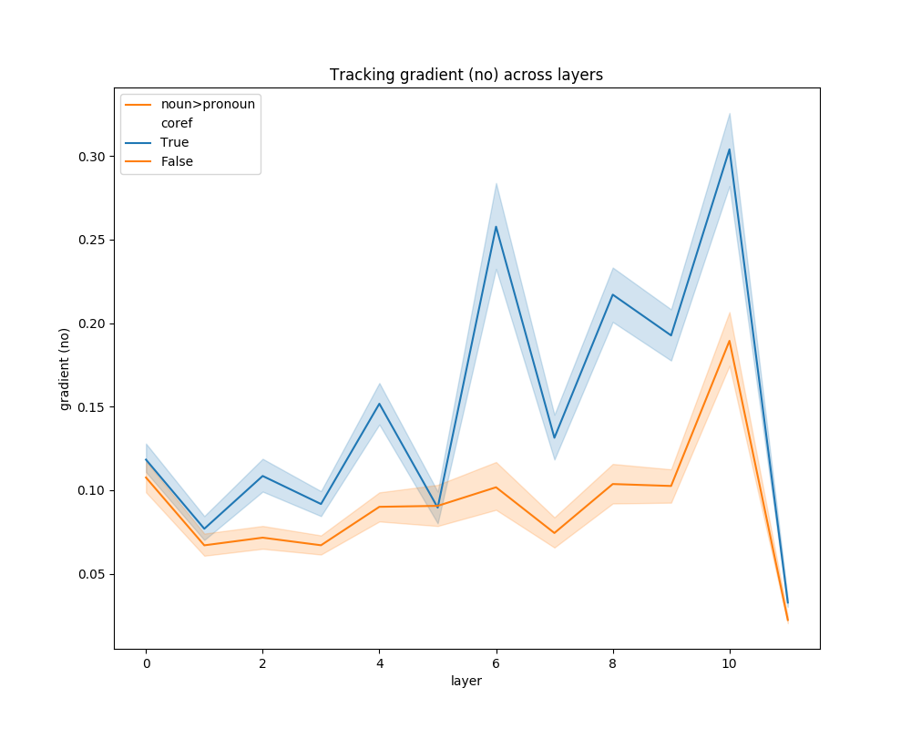

# Bertology #

Motivation: visualizing BERT's attention per head (as in https://github.com/jessevig/bertviz) is too much data for a human mind to comprehend. 
This is an attempt at distilling more global but still interpretable patterns from BERT. 
It does so primarily by averaging over attention heads, by lumping certain tokens together into interesting groups (e.g., subject vs. object), and by reading data files that are structured much like linguistic experiment, crossing certain factors of interest.

The file `experiment.py` does the following:

1. apply BERT to the data (code from pytorch_pretrained_bert with modifications from bertviz and some further changes),
2. extract either gradients or attention weights (specifiable by --method),
3. process these in a certain way, e.g., averaging across attention heads, experimental conditions, and/or groups of tokens,
4. plot the result, potentially comparing multiple experimental conditions defined in the input data file or given by --factors.

To run this code with default settings and example data, do:

`python experiment.py data/example.csv`

For more info enter `experiment.py -h`, as the argument parser is fairly instructive.

## Different possible methods ##

Methods are defined by the command line arguments `--method` and `--combine`.

Argument `--method` specifies how to compute how much token _i_ depends on token _j_. It can be:
- `gradient`: gradient of token _i_ wrt. token _j_.
- `attention`: attention weight of token _i_ wrt. token _j_. 

Argument `--combine` specifies how gradients/attention weights across different layers _n_ are to be combined. It can be:
- `no`: treat each layer separately, i.e., how much token _i_ in layer _n_ depends on token _j_'s representation in layer _n-1_.
- `cumsum`: cumulative sum, across layers, of the foregoing.
- `chain`: influence through the entire network, i.e.: how much token _i_ in layer _n_ depends on token _j_'s representation _prior to layer 0_.

## Input data format ##

`experiment.py` takes as input a `.csv` file, containing on each line a sentence prefixed by a number of specifiers.
The specifiers will be treated as levels of experimental factors to be crossed. 
For instance, the file `data/example.csv` has two factors.
Here's an excerpt:

`...` 
`reflexive, masculine, |0 The teacher | wants |1 every boy | to like |2 himself.`  
`irreflexive, feminine, |0 My mother | thinks |1 the girl next door | really hates |2 her.`  
`reflexive, feminine, |0 The officer | told |1 her trainee | not to shoot |2 herself | in the leg.`  
`...`
 
In this case the factors/levels reflect the pronoun used. 
The first factor has levels [reflexive, irreflexive], the second factor has levels [masculine, feminine].
`experiment.py` will group the data by these factors/levels, plotting their comparison like a proper experiment.

#### Grouping tokens ####

Sentences can be given as such, or with tokens 'grouped' in ways deemed interesting.
The weights/gradients for all tokens in a group will be averaged by default (otherwise summed if specified), and the resulting group weights will be plotted.

###### [Note: running without groups currently requires sentences to have the same number of words]

Groups are separated by `|`, and are optionally numbered. Unnumbered groups will be ignored.

`|0 The teacher | wants |1 every boy | to like |2 himself.`

This achieves that only the attention weights or gradients for the noun phrases will be compared/plotted.

Groups can also be _discontinuous_, e.g., if we want to lump together two coreferring items:

`|0 The teacher | told me that |0 he | wants |1 every boy | to like |2 himself.`  

There are two group labels `|0`, and these will be merged, i.e., their weights/gradients averaged.

#### Legend ####

It is recommended that the first line in the data file, prefixed with `#`, is included as a _legend_.
For instance, `example.csv` contains the following: 
 
 `# reflexivity, gender, |0 np1, |1 np2, |2 pronoun`  
  
This specifies that the factors are called 'reflexivity' and 'gender', respectively, and that the token groups should be called 'np1', 'np2' and 'pronoun'.
If no legend is provided, automatic names 'f1', 'f2' for factors, 'g1', g2' and 'g3' for groups would be used.

## Explore ##

Once again, I'd suggest you do `python experiment.py -h`, since the argument parser is fairly instructive.
There are various options I haven't mentioned here.
For plots comparing coreferring to non-coreferring pronouns, I did something like (choose smaller --n_items, like 5, for quicker testing):

`python experiment.py data/ontonotes_dev_info_NN-PRP.csv --cuda --method gradient --combine no --n_items 500 --factors coref --track noun,pronoun --prefix COREF'

And there are more options still, like the fancy --heatmap --gif combo (if it still works; haven't used it in a while...).

## What about `dependency.py`? ##

That's a slightly less clean file representing my thus far unconclusive attempt at correlating BERT's weights/gradients with dependency trees.